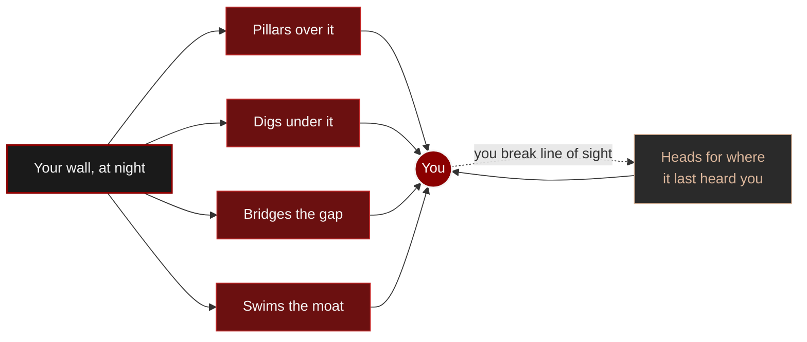

# 🧟 LethalBreed

### Vanilla zombies become a relentless, environment-aware threat.

A Fabric mod that turns Minecraft's zombies into a **systemic, escalating threat**: flow-field pathfinding
that pillars, digs, bridges and swims, hunting by sight **and** sound, endless phase escalation, a
contamination plague and 8 special variants — built to scale toward ~1000 active zombies. Every mechanic and
parameter is documented on the site, in French and English.

> [!WARNING]
> LethalBreed drives zombie AI itself, so it **cannot** run alongside any other mod that alters it.
> Known ids are refused at startup; an unlisted one is caught from the goals attached to the first
> zombie it meets. Everything that does not touch zombie AI is fine, performance mods included.

The mod is in [`mod/`](mod/).

> [!IMPORTANT]
> © Dreyka Oas — all rights reserved. Free to play and to share unmodified; **not** to sell, fork or
> reuse without asking. See [LICENSE](LICENSE).
