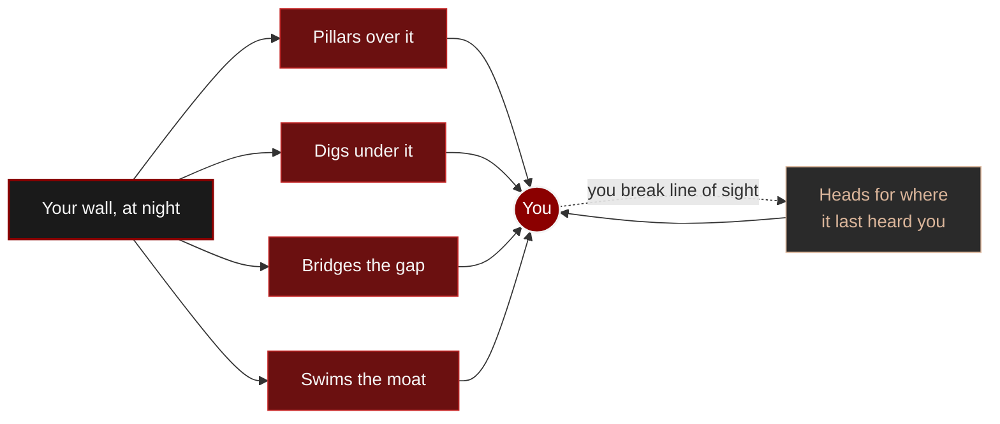

# LethalBreed

A Fabric mod that turns Minecraft's zombies into a relentless, environment-aware threat: flow-field pathfinding
that pillars, digs, bridges and swims, hunting by both sight and sound, endless phase escalation, a
contamination plague and 8 special variants, built to scale toward ~1000 active zombies. Every mechanic and
parameter is documented on the site, [lethalbreed.pages.dev](https://lethalbreed.pages.dev), in French
and English.

LethalBreed drives zombie AI itself, so it cannot run alongside any other mod that alters it. Known ids
are refused at startup; an unlisted one is caught from the goals attached to the first zombie it meets.
Everything that does not touch zombie AI is fine, performance mods included.

Addons implement `oas.dreyka.lethalbreed.api.LethalBreedAddon` and declare it under the
`lethalbreed:addon` entrypoint. See `LethalBreedApi` for the phase event and the AI namespace allowlist,
which is how an addon's own zombie goal avoids being read as a conflict.

A Fabric mod. The mod is in [`mod/`](mod/).

MIT, © 2026 Dreyka Oas. Play it, share it, fork it, build an addon on it and publish that addon, all
without asking. Keep the copyright and permission notice with any substantial copy of the code, which
is the whole of what MIT requires. See [LICENSE](LICENSE). A mention is welcome as a courtesy, never
as a condition.
